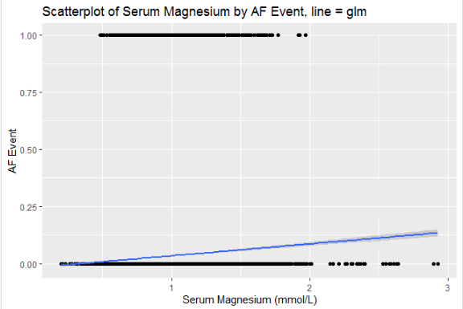
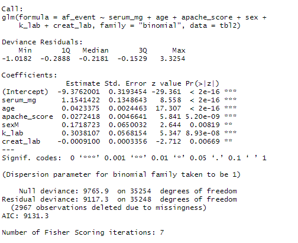
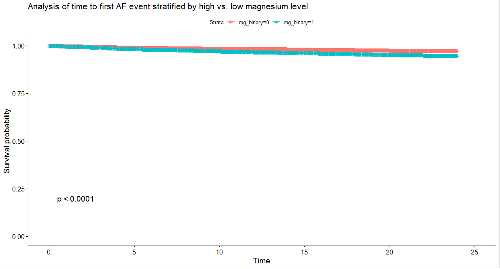

```{r setup, include=FALSE}
knitr::opts_chunk$set(echo = TRUE)
require(knitr)
library(tidyverse)
library(tableone)
library(knitr)
```

# Introduction


Serum magnesium concentration is a commonly measured blood test performed on patients admitted to intensive care.  

The normal serum range is 0.6 to 1.0 mmol/L (1.5 - 2.4 mg/dL) as reported from the University College London Hospital Laboratory Service.  

Magnesium is the fourth most abundant cation in the body.  Predominantly concentrated intracellularly it is responsible for enzyme processes, DNA and cell membrane stabilisation and regulation of cardiac and smooth muscle tone.  Specifically at the myocardial level it regulates the activity of the sodium/potassium ATPase pump.  

Previous studies of serum magnesium in intensive care have suggested the majority of patients to be magnesium deficient (<0.6 mmol/L) via multiple aetiologies.  

Magnesium is also frequently supplemented in ICU to maintain normal, or occasionally supra-normal serum concentrations.  This is in response to a range of provoking factors:

  * Prevention of abnormal cardiac rhythms (e.g. Atrial Fibrillation, AF)
  * Treatment of abnormal cardiac rhythms (e.g. AF or Torsades de Pointes)
  * Treatment of eclampsia
  * Treatment of moderate-severe exacerbations of asthma
  * Treatment of hypokalaemia
  
It is a commonly held belief that magnesium supplementation in a critical care setting is efficacious as prophylaxis against developing de novo atrial fibrillation.

This belief stems from a plausible biological mechanism of action, in addition to multiple observational studies and randomised controlled trials.  

## Existing Literature


**Meta-Analyses**


1.  Intravenous magnesium prevents atrial fibrillation after coronary artery bypass grafting: a meta-analysis of 7 double-blind, placebo-controlled, randomised trials, 2012.

Pooled analysis showed significantly reduced postoperative AF (RR 0.64) with magnesium treatment with no heterogeneity.


**Systematic Reviews**


1.  Interventions for preventing postoperative atrial fibrillation in patients undergoing heart surgery, Cochrane Review, 2013.

21 RCTs of 2988 patients undergoing cardiac surgery.  All mg dosing IV but dosing varied, half studies had intra-op magnesium.

Pooled analysis showed significantly reduced postop AF in treatment group (16.5%) vs. control (26.2%), OR 0.55.


**Randomised Controlled Trials**


1.  Effects of intravenous magnesium sulphate in suspected acute myocardial infarction on acute arrhythmias and long term outcome, 1995. 


**Literature Reviews**


1.  New-onset atrial fibrillation in adult patients after cardiac surgery, 2019.

Incidence of AF after non-cardiac surgery estimated between 1 and 15% (10-30% for thoracic surgery, 25-50% after cardiac surgery).  

Good data that postop AF is associated with badness (stroke, infection, GI and renal dysfunction, increased short and long term morbidity and mortality, increased length of hospital stay).  

Multifactoral pathogenesis.  Risk factors for atrial stretch include hypertension, myocardial ischaemia, valvular dysfunction such as mitral regurgitation.  Postop pro-arrhythmogenic factors include increased endogenous catecholamines, inflammatory and oxidative mediators, plus the use of exogenous catecholamines.

More general risk factors:
  - History of PAF
  - Obesity
  - COPD
  - Chronic renal failure
  - Rheumatic heart disease
  - Male gender
  - Age

In cardiac surgery two periods of increased risk have been identified, immediate (zero hour to first 18 hours postop) and delayed (24-48 hours).  


**Observational**


1.  Low serum magnesium and the development of atrial fibrillation in the community: The Framingham Heart Study, 2013.

In their retrospective analysis of 3530 patients from the Framingham Offspring Study, Khan et al found a moderate association between hypomagnesaemia and subsequent development of atrial fibrillation (adjusted HR 1.52, 1.00 - 2.31, P = 0.05).


2.  Are serum magnesium and potassium levels associated with atrial fibrillation following cardiac surgery? 2019.

In this observational cohort study, Howitt et al reviewed heart rhythm data for 3068 post cardiac surgery patients.  The incidence of AF was 17.8%.  After adjusting for logistic EuroScore, operation type, bypass time and age they found potassium < 4.5 associated with AF (OR 1.43), mean magnesium < 1 was not associated with AF, but administration of magnesium was associated with increased risk of developing AF.  


3.  Potassium and magnesium supplementation do not protect against atrial fibrillation after cardiac surgery: a time-matched analysis, 2016.


4.  Database evaluation of the association between serum magnesium levels and the risk of atrial fibrillation in the community, 2015.  


5.  Association of serum magnesium on mortality in patients admitted to the intensive care unit, 2017.


```{r, echo=FALSE}
lit <-
  tibble(
  Study = c("Khan et al",
            "Howitt et al",
            "Lancaster et al",
            "Markovits et al",
            "Naksuk et al",
            
            "Arsenault et al",
            "Gu et al"),
  
  Journal = c("Circulation",
              "Journal of Cardiothoracic and Vascular Anesthesia",
              "Annals of Thoracic Surgery",
              "International Journal of Cardiology",
              "American Journal of Medicine",
              
              "Database of Cochrane Reviews",
              "Trials"),
  
  Year = c(2013,
           2019,
           2016,
           2015,
           2017,
           
           2013,
           2012),
  
  Type = c("Observational",
           "Observational",
           "Observational",
           "Observational",
           "Observational",
           
           "Systematic Review",
           "Meta-Analysis"),
  
  Design = c("Retrospective Cohort",
             "Retrospective Cohort",
             "Retrospective Case-Control: Time-Matched Analysis",
             "Retrospective Cohort",
             "Retrospective Cohort",
             
             "Cochrane Review",
             "Meta-Analysis"),
  
  Population = c("Community, US",
                 "Post Cardiac Surgery, UK",
                 "Post Cardiac Surgery, US",
                 "Community, Israel",
                 "Cardiac Care Unit (Medical), US",
                 
                 "Post Cardiac Surgery",
                 "Post Coronary Artery Bypass Grafting"),
  
  Findings = c("Low magnesium associated with developing AF in the community",
               "Potassium < 4.5 associated with AF; mean Mg < 1 not associated with AF; administering Mg associated with AF",
               "Higher potassium and magnesium associated with AF; magnesium independent predictor of AF in multivariate analysis; magnesium supplementation associated with increased AF.",
               "Increased AF associated with mild and moderate hypomagneseaemia, not time-dependent suggesting non-causal relationship",
               "Increased mortality associated with Mg > 1.2 in multivariate analysis",
               
               "Significantly decreased postoperative AF with treatment vs. control",
               "Significantly decreased postoperative AF with magnesium with minimal heterogeneity between trials")
  
)

kable(lit, caption = "Summary of Existing Literature")
```


## Aims


1.  Describe the epidemiology of serum magnesium in a general ICU patient cohort

2.  Describe the possible association between AF and serum magnesium

3.  Describe practice preferences for magnesium replacement based on varying serum magnesium concentrations

4.  Derive the causal impact of supplemental magnesium administration on prophylaxis of AF in this population


# Data Sources


The Philips ICIP database was interrogated for serum magnesium lab measurements, magnesium administration and nurse identifier data.

The CCHIC database was used to extract data pertaining to the following:

* Age at admission
* Sex
* Length of stay
* Admission classification
* Illness severity by APACHE score
* CPR in 24 hours prior to admission
* Unit mortality
* Heart rhythm
* Heart rate
* Serum potassium lab and point of care measurements
* Serum pH, bicarbonate, arterial carbon dioxide from point of care measurements
* Serum Creatinine


# Pipeline


```{r, echo=FALSE}
knitr::include_graphics("./images/pipeline.png")
```


# Data Summary


## Exclusion Criteria


Patients < 18 years old on admission were excluded.  

Additional exclusion criteria were applied specific to each analysis as detailed below.


The final joined data consists of 38,222 observations of 5739 individual patients (as determined by unique patient identity numbers), across 6675 distinct episodes (as defined by unique CCHIC episode identity numbers).  There were 6776 distinct episodes defined using ICIP episode identity numbers.  

The distribution of number of episodes per patient can be seen below.


```{r,results='asis', echo=FALSE}
# Summary from "tbl_3.RData" file from cleaned pipeline

# number of observations: 38,222

# number of patients:

num_pts <- 5739

# number of episodes:

num_epi_cchic <- 6776
num_epi_icip <- 6668

# range of episodes per patient:

epi_pp <- tibble("Number of Episodes" = c(1:9),
                 "Number of Patients" = c(5030,
                           561,
                           103,
                           26,
                           10,
                           6,
                           1, 1, 1))
kable(epi_pp, caption = "Number of Episodes Per Patient")

```


## Missing Data


The proportion of missing data for each variable in the final data table can be seen below, described per patient.


```{r, results='asis', echo=FALSE}
# table for missing data per Episode:

missing_data_pt <- 
  tibble(Variable = c("Age",
                      "Sex",
                      "Length of Stay",
                      "Admission Type",
                      "APACHE Score",
                      "CPR in Prev. 24 hours",
                      "Unit Mortality",
                      "Potassium at Magnesium Measurement",
                      "Creatinine at Magnesium Measurement",
                      "pH at Magnesium Measurement"),
         Count = c(0, 1, 0, 0, 37, 2,0,1423,1235,2531),
         Percentage = round(Count/num_epi_cchic * 100, 2))

kable(missing_data_pt, caption = "Missing Data Per Episode")

```

## Sample Characteristics


The summary of all the covariates is conducted at the episode level or for individual magnesium windows created.


### Age

The sample age range was 18 to 103 years old.  The median age was 64 (52.5 - 75.5).


```{r, echo=FALSE}
knitr::include_graphics("./images/dist_age_sex.png")
```


### Sex


```{r, results='asis', echo=FALSE}
# number of male and female patients in dataset

sex <- tibble(
  sex = c("F", "M", "NA"),
  count = c(2929, 2809, 1),
  prop = count/num_pts *100)

kable(sex, caption = "Distribution of Sex")
```


### Length of Stay


The median length of stay per episode was 2.3 days (0.3 - 4.3).  

```{r, results='asis', echo=FALSE}

# Length of Stay:

# median across all episodes: 2.3 days
# IQR across all episodes: 4 days

los_sex <- tibble(
  sex = c("F", "M"),
  median_los = c(2.19, 2.55),
  iqr_los = c(3.65, 4.89)
)

kable(los_sex, caption = "Length of Stay (Days) by Sex")
```


### Admission Type


Admissions were classified as planned medical or surgical and 'other'.  'Other' is a composite of unplanned local admissions or transfers, planned transfers and repatriations.  

There were 85 episodes labelled as planned medical admissions, 2460 planned surgical episodes and 4130 episodes of admission type 'Other'. 

```{r,results='asis', echo=FALSE}
# Admission type:
  # L = unplanned local admission
  # U = unplanned transfer in 
  # P = planned transfer in
  # S = planned local surgical admission
  # M = planned local medical admission
  # R = repatriation

adm_type_row <- tibble(
  type = c("Medical", "Surgical", "Other"),
  count = c(262, 8234, 29726),
  prop = count/38222 * 100)

# now done grouped by episode:

adm_type_episode <- 
  tibble(
    type = c("Medical", "Surgical", "Other"),
    count = c(85, 2460, 4130),
    prop = count/num_epi_cchic * 100)

kable(adm_type_episode, caption = "Categorised Admission Type")

```


### APACHE Score


Severity of illness was estimated by admission APACHE score.  This was absent for 37 episodes.  The median APACHE score per episode was 16 (12 - 20).  This was the same for males and females.  


### CPR Pre-Admission


In addition, whether the patient underwent CPR in the 24 hours preceding admission was also recorded.  Two patients were missing CPR data.    


```{r, results='asis', echo=FALSE}
cpr <- matrix(c(77, 3288, 1, 103, 3204, 1), ncol = 3, byrow = T)
colnames(cpr) <- c("CPR", "No CPR", "Missing")
rownames(cpr) <- c("Female", "Male")

cpr <- as.table(cpr)

kable(cpr, caption = "CPR in 24 hours prior to admission")

# nb equates to 6775 episodes because of the 1 episode with NA for sex
```


### Unit Mortality

Unit mortality 9.25% across all selected episodes.  The mean serum magnesium on admission for surviving patients was 0.795 mmol/L, versus 0.868 mmol/L for those who died.


## Magnesium 

The distribution of serum magnesium measurements on first arrival to ICU is described below.  The admission serum magnesium is defined as the first recorded magnesium lab measurement associated with the episode following the final joining process.  

For reference the join was defined such that magnesium measurements associated with the episode ID were joined to that episode, occurring up to 12 hours prior to the episode start time identified in the CCHIC data.  This was to allow initial magnesium measurements occurring prior to admission but still influencing decisions taken during the admission to be captured.  For reference, 97% of episodes had their first serum magnesium measurement recorded within 24 hours of the episode start.  

The mean serum magnesium on admission per episode was 0.80 mmol/L (sd, 0.21).  There was minimal difference between men and women (female mean 0.79, male 0.81) and serum magnesium on admission stayed relatively consistent across age range and APACHE score.

```{r, echo=FALSE}
knitr::include_graphics("./images/mg_age_smooth.png")
```


```{r, echo=FALSE}
knitr::include_graphics("./images/mg_sex_box.png")
```

```{r, echo=FALSE}
knitr::include_graphics("./images/mg_apache_smooth.png")
```


The mean serum magnesium value across the duration of the episode was 0.89 mmol/L (sd, 0.15).  

The mean change in serum magnesium value across each episode was -0.11 mmol/L (sd, 0.27).

When stratified by unit mortality, patients who survived had an average serum magnesium of 0.79 mmol/L versus 0.87 in those who died.  

```{r, echo=FALSE}
knitr::include_graphics("./images/mg_mortality.png")
```


The median number of serum magnesium measurements per episode was 3 (1 - 5).  

```{r, echo=FALSE}
knitr::include_graphics("./images/freq_mg_lab.png")
```

The timing of recorded serum magnesium measurements was predominantly concentrated in the morning.

```{r, echo=FALSE}
knitr::include_graphics("./images/lab_timings.png")
```


The median number of administrations per episode was 1 (0 - 2), with a range of 0-76 administrations per episode.


```{r, echo=FALSE}
knitr::include_graphics("./images/admin_timings.png")
```

The timing of magnesium administrations was predominantly concentrated around mid-morning.

```{r, echo=FALSE}
knitr::include_graphics("./images/admin_timings_dist.png")
```


Stratifying serum magnesium measurements by subsequent magnesium administration confirms that magnesium supplementation more commonly occurs predominantly at levels < 1.0 mmol/L.   

```{r, echo=FALSE}
knitr::include_graphics("./images/mg_lab_admin_dist.png")
```

## Potassium

Potassium closest to the serum magnesium lab measurement was extracted from potassium lab measurements.  Where two measurements existed equally distant from the magnesium measurement, the mean was taken.  

There were missing potassium values for 1423 episodes (21%) and 1652 magnesium windows (4.3%).  

The mean potassium for each episode was 4.46 mmol/L (sd, 0.43).  

The mean potassium for each magnesium window was 4.55 mmol/L (sd, 0.55).  The mean potassium for each magnesium window where magnesium was subsequently administered vs. where it was not administered was similar at 4.48 (sd, 0.51) vs. 4.60 (sd, 0.56).  

The mean potassium for each magnesium window where AF subsequently occurred was 4.55 (sd, 0.55) vs. 4.71 (sd, 0.52) where there was no AF. 

The mean potassium closest to the first AF episode in a window (up to three hours preceding event) was 4.35 (sd, 0.52).

The mean potassium at the time of magnesium administration (up to three hours preceding event) was 4.14 (sd, 0.51). 


## Creatinine

Creatinine closest to each serum magnesium lab measurement was extracted.  

There were missing creatinine values for 1235 episodes (18.2%) and 2428 magnesium windows (6.4%).

The mean creatinine across all the magnesium windows was 105 mmol/L.  


## pH

Venous or arterial pH closest to each magnesium lab measurement was extracted.

There were missing pH values for 2531 episodes (37%) and 3873 magnesium windows (10.1%).

The mean pH across all the magnesium windows was 7.38 (sd, 0.07).


## Atrial Fibrillation

There were 639 episodes which started in AF.  AF events were defined as rhythm changes from sinus rhythm or "other" to AF within the magnesium window.  453 episodes contained at least one AF event.  912 magnesium windows contained at least one AF event.  

The mean serum magnesium at the start of the magnesium window for windows with no AF events was 0.93 mmol/L.

The mean serum magnesium at the start of the magnesium window for windows containing an AF event was 1.01 mmol/L.

```{r, echo=FALSE}
knitr::include_graphics("./images/mg_lab_af_dist.png")
```


# Table 1


## Summary of Variables Per Episode


```{r, results='asis', echo=FALSE}

# per episode

table1 <- tibble(
  Variable = c("Median (IQR) Age (Years)",
              "Sex",
              "Median (IQR) Length of Stay (Days)",
              "Admission Type",
              "Median (IQR) APACHE Score",
              "CPR in Prev. 24 hours (%)",
              "Unit Mortality (%)",
              "Mean (sd) Serum Potassium (mmol/L)",
              "Median (IQR) Serum Magnesium Measurements",
              "Mean (sd) Serum Magnesium on admission (mmol/L)",
              "Mean (sd) Serum Magnesium across admission (mmol/L)",
              "Mean (sd) Trend in Serum Magnesium across admission (mmol/L)",
              "Median (IQR) Magnesium Administrations"),
  
  Summary = c("64 +/- 23",
             "Female: 51.0",
             "2.3 +/- 4",
             "Medical: 85 (1.25%), Surgical: 2460 (36.3%), Other: 4130 (61.0%)",
             "16 +/- 8",
             "2.81",
             "9.34",
             "4.46 (0.43)",
             "3 (4)",
             "0.80 (0.21)",
             "0.89 (0.15)",
             "-0.11 (0.27)",
             "1 (2)"
             ))
                                


kable(table1, caption = "Summary of Characteristics Per Patient Episode")
```


## Summary of Variables Per Magnesium Window

This is a summary of each magnesium window after applying exclusion criteria of age < 18 years old.


```{r, results='asis', echo=F}

# here the unit of summary is each mg window, n = 38,222)

table2 <- tibble(
  Variable = c("Number receiving Magnesium Administration (%)",
               "Median (IQR) time to Magnesium Administration (hours)",
               "Range of number of Magnesium Administrations",
               "Mean (sd) Serum Magnesium (mmol/L)",
               "Mean (sd) Serum Potassium (mmol/L)",
               "Number starting in Atrial Fibrillation (%)",
               "Number containing an Atrial Fibrillation Event (%)",
               "Number of Potential Treatment Events (% of total Magnesium Administrations)",
               "Median (IQR) length of Magnesium Window (hours)"),
  # looks like the majority of windows are censored for 24 hours.
  # AF event defined as change from SR-> AF within mg window.
  # treatment event defined as mg_admin occurring after first af

  Summary = c("14,666 (38.4)",
              "6.42 (5.83)",
              "0 - 15 (1.59% with > 1 Magnesium Administration)",
              "0.93 (0.22)",
              "4.55 (0.55)",
              "2854 (7.5)",
              "1173 (3.1)",
              "353 (2.4 of all Mg administrations)",
              "23 (11.0)"))

kable(table2, caption = "Summary of Characteristics Per Magnesium Window")
              

```


# Analysis


## Logistic Regression


Simple logistic regression model:

```{r, echo = FALSE}

# reg <- 
 # glm(af_event ~ serum_mg, data = tbl2, family = "binomial")

#summary(reg)

#exp(1.4763) # 4.377 (odds) per 1 unit mg (i.e. 0.44 increased odds for every 0.1 mmol/L increase in serum mg)
```

This suggests that a one unit increase in serum magnesium is associated with a 1.48 increase in log odds of having an AF event (p < 0.001), or a 0.44 increased odds of developing AF for every 0.1 mmol/L increase in serum magnesium.

```{r, echo=FALSE}

```

After the addition of age, sex, APACHE score, potassium and creatinine at the time of mg measurement to the model:


```{r, echo=FALSE}

```


## Time to Event Analysis

Censor variables were created, starting from the magnesium lab date for each window.  All windows were censored if they reached the end of the window, defined as the minimum of the next magnesium lab measurement, the end of the episode or 24 hours.  Windows were censored if magnesium was administered or the outcome occurred (AF event).

The total follow up time for each variable was create by taking the minimum of all the different censor variables.  

A summary of the times to events are listed below.

```{r}
table3 <- tibble(
  Variable = c("Median (IQR) from mg lab measurement to first mg administration (hours)",
               "Median (IQR) time to first AF event (hours)"),
  # looks like the majority of windows are censored for 24 hours.
  # AF event defined as change from SR-> AF within mg window.
  # treatment event defined as mg_admin occurring after first af

  Summary = c("6.42 (5.83)",
              "8 (10.633)"))

kable(table3, caption = "Times to events")
```


Serum magnesium was initially categorised into low vs. high (serum mg < 1, low).  

```{r}
# surv_object <- Surv(time = tbl2$fu_time, event = tbl2$event)
# fit1 <- survfit(surv_object ~ mg_binary, data = tbl2)
# summary(fit1)
```

The results of the survival analysis are displayed below.

```{r, echo=FALSE}

```

Serum magnesium was also categorised into five boundaries:

  1. Less than 0.5
  2. 0.5 - 0.8
  3. 0.8 - 1.0
  4. 1.0 - 1.2
  5. Greater than 1.2
  

  
```{r, echo=FALSE}
knitr::include_graphics("./images/tte_analysis.PNG")
```


## Instrumental Variable Analysis

### Description of Nurse Data

To facilitate investigation of a causal relationship between clinician and administration of magnesium, a stricter time window was created.

<<<<<<< HEAD
A dataset with more restricted time windows was created for the IV analysis. It consists of 9620 time windows with 164 instances of AF.

Summary information about the data is displayed below.
=======
The original data set was filtered for magnesium lab values occurring between midnight and 10 am.  

This produced a table of 28,681 magnesium windows.  When this was filtered for clinician identifiers being present this reduced to 13,050 magnesium windows.

There were 715 individual clinicians identified within this filtered dataset.  The number of magnesium windows associated with each clinician ID ranged between 1 and 237 (median 3, IQR 1 - 26).

44% of these magnesium windows received a magnesium administration.  3.34% went on to develop AF within the magnesium window.

>>>>>>> 79ad3618e0e46da1c68f58f02d19da32d72138f0

```{r, echo = FALSE}
table4 <- data.frame(
  no_AF = c(5715, 3741),
  AF = c(126, 38))
rownames(table4) <- c("no Mg given", "Mg given")

kable(table4)
```

There were 643 unique day nurses in this dataset.
55 windows where no mg was given until after the first AF. These were treated as instances of AF with no magnesium administered.

The number of windows per nurse ranged from 1 to 117 with a median of 4(1-24). 


# Discussion


Provisional set of analysis for 39,531 magnesium windows has suggested a possible association betweeen higher magnesium levels and onset of atrial fibrillation within the magnesium window.  This association is demonstrated across both basic logistic regression and a time to event analyses.  Once adjusted for age, sex, illness severity and potassium level a significant association persists.


# Next Steps


- Evaluate pipeline integrity:
  - via lab meeting
  - create synthetic test data set

- Explore potential explanation for findings:
  - Cox PH model with additional covariates
  - Multilevel logistic regression to account for episode/pt differences
  
- Use step in serum magnesium administration to create regression discontinuity analysis

- Create stricter magnesium windows with attached nursing data and evaluate behaviour around magnesium administration as first step of IV analysis.


